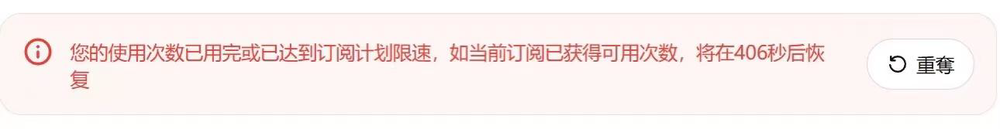

# **集合AI站常见问题自查手册**

---

## **📌导航目录**
1. [传图报错问题](#一传图报错包括但不局限于以下报错类型)
2. [GPT-4使用上限与限额](#二gpt4使用上限已超出用户限额)
3. [限速问题说明](#三限速问题有读秒)
4. [图像模型抽算力与建议](#四官方出新图像模型了抽走部分算力)
5. [违反政策内容处理建议](#五违反内容政策等这个建议换图或提示词)
6. [出图慢或卡顿应对方法](#六出图很卡很慢这个问题建议多开任务解决)
7. [其他常见问题及解决思路](#七其他奇怪的问题解决方法和思路比如卡顿和莫名的报错等)

---

## **一.传图报错：包括但不局限于以下报错类型**

**1.如果使用4o上传多图报错，是图片并发官方返回报错，简单拼图在一起就行，如图4,或者也可转用其他模型如4o-image**

**2.如果上图频繁报错，尽可能压缩到500K以内（最简单的方法微信截图），gpt对上传图片高清度要求并没有多大，能看就行，不会影响输出结果！**

**（图1这种也有一定机率报错后刷新网页会出现对话，实际已经在生成中了）**

  
  
  

---

## **二.Gpt4使用上限、已超出用户限额**

**触发这种就“右上角点击头像然后注销，然后重新进入，然后左下角点击新版gpt 入口”**

**不会注销的看一下我们的总文档续费教程那里，注销退出去再进来新版plus就是，注销的意思大家可以理解成电脑注销，对号不会有任何影响！**

  

---

## **三.限速问题（有读秒）**

**这个是天卡用户3 小时只能用40 次，到时间后恢复，周卡和月卡不限制，续费周卡月卡激活码用上也会解除**

---

## **四.官方出新图像模型了，抽走部分算力，用4o的，如果出的图不对劲用/调用创建图像**

---

## **五.违反内容政策等，这个建议换图或提示词**

**出政策限制，如果刷几次还是不行的话，要么换图，要么换提示词，硬杠没意义的，像吉卜力这些有时会放行，涉及到更深的不会放的**

  

**或者到小红书学习，有一些办法和技巧可以绕过，一些政策限制和防止坏人拿去作恶，肯定会越来越严格的**

**注意：如果用的是4o-image，遇政策限制可能直接报错不给图（如图2），是官方返回错误导致，如果不确定提示词、图是否涉及违规和侵权，可以到4o模型再测试**

  

---

## **六.出图很卡很慢，这个问题建议多开任务解决**

**4o返回下面这个也是正常现象，是官方提示繁忙，不用理会，新开其他任务，晚点返回再看**

---

## **七：其他奇怪的问题解决方法和思路，比如卡顿和莫名的报错等**

**1.不要开魔法，或者换一个不影响的节点，有时退出魔法后也可能会导致网络代理错乱。**

**2.切换一个网站，我们有四个可用分站**

**3.尽量用我们推荐的edge浏览器，或者谷歌浏览器，不要使用国产浏览器如360，夸克，QQ浏览器等，如果遇问题可以切换浏览器试试。**

**4.注销再重进新版plus（很多奇怪的问题重进多一两次基本能解决）**

**5.遇到会话报错，不要在一个会话折腾，新开会话**

**6.清理浏览器cookies。**

**7.用软件修复一下网络。**

**8.切换个网络或设备试试，比如从手机换成电脑，家宽改成流量等等。**

**9.如果以上都解决不了，找群主文文协助解决！**

---

## [点击这里返回总文档](https://gitee.com/chatsharebiz/chatshare/)
